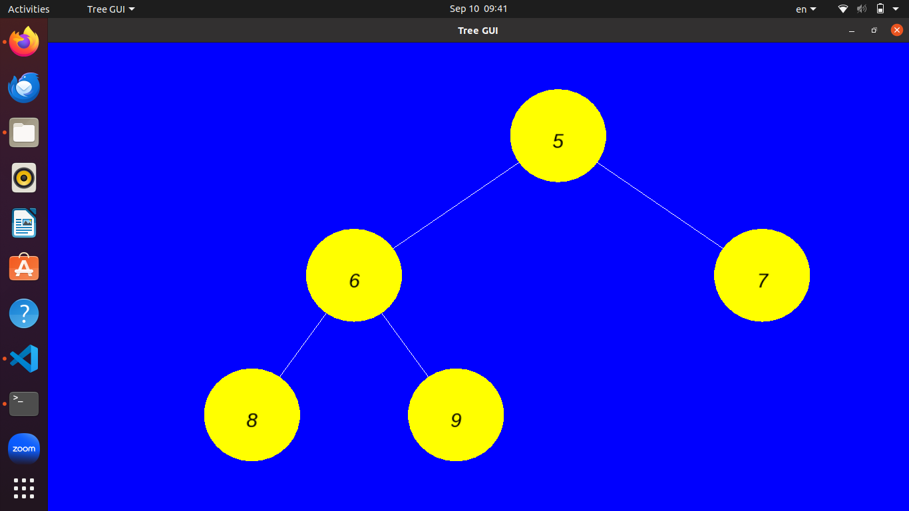

# TREE GUI AND ITERATORS

In this project we are creating a tree graph that can be in default a `binary tree` or a   `k-tree` means that each childe has not more than k children.

## Classes
### Node class
This class represent each of the tree's root children.  
The Node is generic by using `templae<T>`
it get a value to assign to each Node, and has also a vector that keep his children.

### Complex
This class represent a complex number such as `1+2i`.
The class also overloading the basic operators (+ , - , = , < , etc..).
The idea is to shoe that our Node and Tree will be able to get also types and objects that we define.

### Tree class
This is our main class.
This calss represent a K-nary tree, by default it a binary tree.
Each tree has it's root to start from, size, and how many children can each node hold
The tree is build from nodes.

we have the basic method `add_root` that adding a root to the tree and `add_sub_node` to add children for each node we want.

## Iterators
To iterate a graph, or in our case tree, we have all kinds of way here we implemented few of the known.  
1. **BFS**
2. **DFS**
3. **Pre-order (Root, Left, Right)**
4. **In-order (Left, Root , Right)**
5. **Post-order (Left, Right, Root)**
6. **Heap** - we taking the tree and make it to a heap tree.

For each tree that is not a `binary-tree` the 3 simple tree traversal (pre/in/post-order) we used DFS, as the guids of the assignment

Each Irerator is a nested class in the tree class.  
Each iterator is implementing it's own way for iteration (how to use the == operator, and what the ++ operator will show next, how to get the value by * ,and the iteration itself, etc).

After this in for each iterator, there is the function the activates it, for example:  
`begin_BFS()` - returning the BFS iteratos from the root

`end_BFS()` - returning the BFS iteratos from nullptr. that will stop the iterator

Here is an example from the main.cpp:
```cpp
    cout << "Looping BFS for string with 3 children:" << endl;
    for (auto it = tree_str.begin_BFS(); it != tree_str.end_BFS(); ++it)
    {
        cout << (it)->get_value() << " ";
    }
    cout << endl;
```


## Runing the project
To run this project at first clone this repo
```bash
git clone https://github.com/chanan-hash/Tree-Iterators.git
```

Then you should ensure that you have g++ compiler. if not you can installl it with all `c` and `c++` needed
```bash
sudo apt-get update
sudo apt-get install build essential
``` 
allso check that you have `valgrind` installed
```bash
sudo apt install valgrind
```
**For gui to show the tree we've used `SFML`.**  
You must have it that the project can run.  You can instaal it by this command:
```bash
sudo apt-get install libsfml-dev
```
### Runing the groject itself
After you have all the packges
we can run the project
run `make`
if will compile everything
then to run the project run:
`./tree`  
and the program will run.
You can also run `make tree`.  
It will show you the tree in a window, and prints in the terminal of all the iterators.
For each tree it will open a window, so to see the next tree you need to close the current window, and automatically it will open the next one.  
Here is example of what you'll see:  


### Test
For testing our program we've used `doctest.h`.
To run the test just write
`make test` and it'll run the test automatically

### HAVE FUN! : ) 